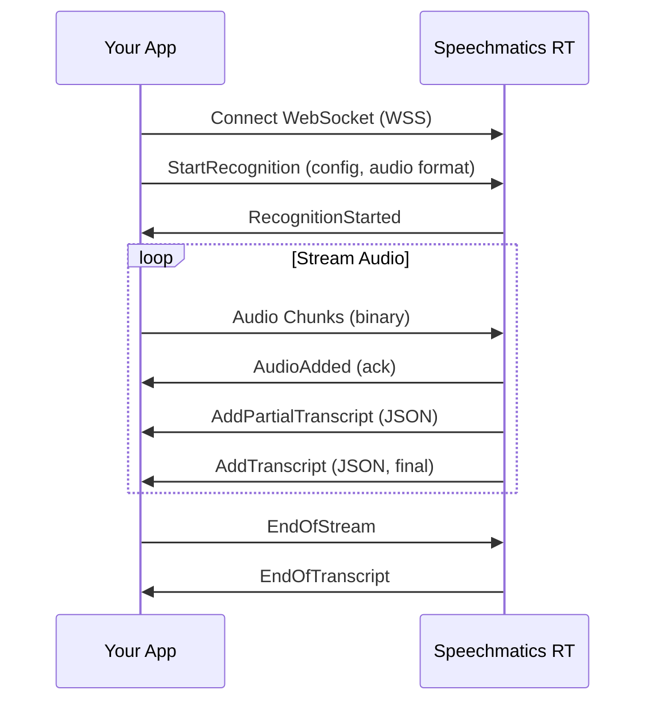
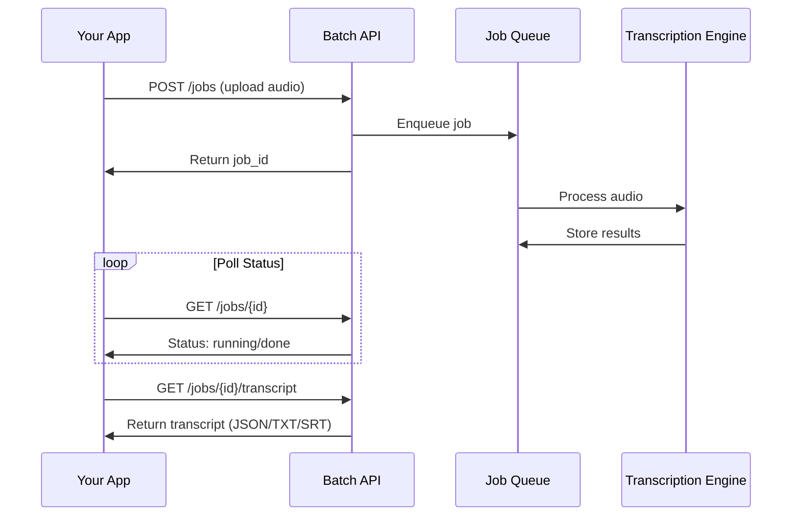

<div align="center">

<picture>
  <source media="(prefers-color-scheme: dark)" srcset="./logo/speechmatics-dark-theme-logo.png">
  <source media="(prefers-color-scheme: light)" srcset="./logo/speechmatics-light-theme-logo.png">
  
</picture>

<br/>

**Speechmatics Python SDK provides convenient access to enterprise-grade speech-to-text APIs from Python applications.**

[](https://pypi.org/project/speechmatics-batch/)
[](https://pypi.org/project/speechmatics-rt/)
[](https://pypi.org/project/speechmatics-voice/)
[](https://pypi.org/project/speechmatics-batch/)
[](https://github.com/speechmatics/speechmatics-python-sdk/blob/main/LICENSE)
[](https://github.com/speechmatics/speechmatics-python-sdk/actions/workflows/test.yaml)


**Fully typed** with type definitions for all request params and response fields. **Modern Python** with async/await patterns, type hints, and context managers for production-ready code.

**55+ Languages • Realtime & Batch • Custom Vocabularies • Speaker diarization • Speaker ID**

[Get API Key](https://portal.speechmatics.com/) • [Documentation](https://docs.speechmatics.com) • [Academy Examples](https://github.com/speechmatics/speechmatics-academy)


</div>

---

## 📋 Table of Contents

- [Quick Start](#quick-start)
- [Why Speechmatics?](#-why-speechmatics)
- [Key Features](#-key-features)
- [Use Cases](#-use-cases)
- [Documentation](#-documentation)
- [Authentication](#authentication)
- [Advanced Configuration](#advanced-configuration)
- [Deployment Options](#deployment-options)
- [Community & Support](#community--support)

---

<h2 id="quick-start">⚡ Quick Start</h2>

### Installation

```bash
# Choose the package for your use case:

# Batch transcription
pip install speechmatics-batch

# Realtime streaming
pip install speechmatics-rt

# Voice agents
pip install speechmatics-voice

# Text-to-speech
pip install speechmatics-tts
```

<details>
<summary><strong>📦 Package Details</strong> • Click to see what's included in each package</summary>

<br/>

**[speechmatics-batch](./sdk/batch/README.md)** - Async batch transcription API
- Upload audio files for processing
- Get transcripts with timestamps, speakers, entities
- Supports all audio intelligence features

**[speechmatics-rt](./sdk/rt/README.md)** - Realtime WebSocket streaming
- Stream audio for live transcription
- Ultra-low latency (150ms p95)
- Partial and final transcripts

**[speechmatics-voice](./sdk/voice/README.md)** - Voice agent SDK
- Build conversational AI applications
- Speaker diarization and turn detection
- Optional ML-based smart turn: `pip install speechmatics-voice[smart]`

**[speechmatics-tts](./sdk/tts/README.md)** - Text-to-speech
- Convert text to natural-sounding speech
- Multiple voices and languages
- Streaming and batch modes

</details>

### Setting Up Development Environment

```bash
git clone https://github.com/speechmatics/speechmatics-python-sdk.git
cd speechmatics-python-sdk

python -m venv .venv
.venv\Scripts\activate
# On Mac/Linux: source .venv/bin/activate

# Install development dependencies for all SDKs
make install-dev

# Install pre-commit hooks
pre-commit install
```

### Your First Transcription

**Batch Transcription** - transcribe audio files:

```python
import asyncio
import os
from dotenv import load_dotenv
from speechmatics.batch import AsyncClient

load_dotenv()

async def main():
    client = AsyncClient(api_key=os.getenv("SPEECHMATICS_API_KEY"))
    result = await client.transcribe("audio.wav")
    print(result.transcript_text)
    await client.close()

asyncio.run(main())
```

**Installation:**
```bash
pip install speechmatics-batch python-dotenv
```

**Realtime streaming** - live microphone transcription:

```python
import asyncio
import os
from dotenv import load_dotenv
from speechmatics.rt import (
    AsyncClient,
    ServerMessageType,
    TranscriptionConfig,
    TranscriptResult,
    AudioFormat,
    AudioEncoding,
    Microphone,
)

load_dotenv()

async def main():
    client = AsyncClient(api_key=os.getenv("SPEECHMATICS_API_KEY"))
    mic = Microphone(sample_rate=16000, chunk_size=4096)

    @client.on(ServerMessageType.ADD_TRANSCRIPT)
    def on_final(message):
        result = TranscriptResult.from_message(message)
        if result.metadata.transcript:
            print(f"[final]: {result.metadata.transcript}")

    @client.on(ServerMessageType.ADD_PARTIAL_TRANSCRIPT)
    def on_partial(message):
        result = TranscriptResult.from_message(message)
        if result.metadata.transcript:
            print(f"[partial]: {result.metadata.transcript}")

    mic.start()

    try:
        await client.start_session(
            transcription_config=TranscriptionConfig(language="en", enable_partials=True),
            audio_format=AudioFormat(encoding=AudioEncoding.PCM_S16LE, sample_rate=16000),
        )
        print("Speak now...")

        while True:
            await client.send_audio(await mic.read(4096))
    finally:
        mic.stop()
        await client.close()


asyncio.run(main())
```

**Installation:**
```bash
pip install speechmatics-rt python-dotenv pyaudio
```

**Text-to-Speech** - convert text to audio:

```python
import asyncio
import os
from dotenv import load_dotenv
from speechmatics.tts import AsyncClient, Voice, OutputFormat

load_dotenv()

async def main():
    client = AsyncClient(api_key=os.getenv("SPEECHMATICS_API_KEY"))

    response = await client.generate(
        text="Hello! Welcome to Speechmatics text to speech.",
        voice=Voice.SARAH,
        output_format=OutputFormat.WAV_16000
    )

    audio_data = await response.read()
    with open("output.wav", "wb") as f:
        f.write(audio_data)
        print("Audio saved to output.wav")

    await client.close()

asyncio.run(main())
```

**Installation:**
```bash
pip install speechmatics-tts python-dotenv
```

**Voice agent** - real-time transcription with speaker diarization and turn detection:

```python
import asyncio
import os
from dotenv import load_dotenv
from speechmatics.rt import Microphone
from speechmatics.voice import VoiceAgentClient, VoiceAgentConfigPreset, AgentServerMessageType

load_dotenv()

async def main():
    client = VoiceAgentClient(
        api_key=os.getenv("SPEECHMATICS_API_KEY"),
        config=VoiceAgentConfigPreset.load("adaptive")
    )

    @client.on(AgentServerMessageType.ADD_SEGMENT)
    def on_segment(message):
        for segment in message.get("segments", []):
            print(f"[{segment.get('speaker_id', 'S1')}]: {segment.get('text', '')}")

    @client.on(AgentServerMessageType.END_OF_TURN)
    def on_turn_end(message):
        print("[END OF TURN]")

    mic = Microphone(sample_rate=16000, chunk_size=320)
    mic.start()

    try:
        await client.connect()
        print("Voice agent ready. Speak now...")

        while True:
            await client.send_audio(await mic.read(320))
    finally:
        mic.stop()
        await client.disconnect()

asyncio.run(main())
```

**Installation:**
```bash
pip install speechmatics-voice speechmatics-rt python-dotenv pyaudio
```

**Simple and Pythonic!** Get your API key at [portal.speechmatics.com](https://portal.speechmatics.com/)

> [!TIP]
> **Ready for more?** Explore 20+ working examples at **[Speechmatics Academy](https://github.com/speechmatics/speechmatics-academy)** — voice agents, integrations, use cases, and migration guides.

---

## 🏆 Why Speechmatics?

### Accuracy That Matters

When 1% WER improvement translates to millions in revenue, you need the best.

| Metric | Speechmatics | Deepgram |
|--------|--------------|----------|
| **Word Error Rate (WER)** | **6.8%** | 16.5% |
| **Languages Supported** | **55+** | 30+ |
| **Custom dictionary** | **1,000 words** | 100 words |
| **Speaker diarization** | **Included** | Extra charge |
| **Realtime translation** | **30+ languages** | ❌ |
| **Sentiment analysis** | ✅ | ❌ |
| **On-premises** | ✅ | Limited |
| **On-device** | ✅ | ❌ |
| **Air-gapped deployment** | ✅ | ❌ |


### Built for Production

- **99.9% Uptime SLA** - Enterprise-grade reliability
- **SOC 2 Type II Certified** - Your data is secure
- **Flexible Deployment** - SaaS, on-premises, or air-gapped

---

## 🚀 Key Features

### Realtime transcription
Stream audio and get instant transcriptions with ultra-low latency. Perfect for voice agents, live captioning, and conversational AI.

```python
import asyncio
import os
from dotenv import load_dotenv
from speechmatics.rt import (
    AsyncClient,
    ServerMessageType,
    TranscriptionConfig,
    TranscriptResult,
    AudioFormat,
    AudioEncoding,
    Microphone,
)

load_dotenv()

async def main():
    # Configure audio format for microphone input
    audio_format = AudioFormat(
        encoding=AudioEncoding.PCM_S16LE,
        chunk_size=4096,
        sample_rate=16000,
    )

    # Configure transcription with partials enabled
    transcription_config = TranscriptionConfig(
        language="en",
        enable_partials=True,
    )

    # Create client
    client = AsyncClient(api_key=os.getenv("SPEECHMATICS_API_KEY"))

    # Handle final transcripts
    @client.on(ServerMessageType.ADD_TRANSCRIPT)
    def handle_transcript(message):
        result = TranscriptResult.from_message(message)
        if result.metadata.transcript:
            print(f"[final]: {result.metadata.transcript}")

    # Handle partial transcripts (interim results)
    @client.on(ServerMessageType.ADD_PARTIAL_TRANSCRIPT)
    def handle_partial(message):
        result = TranscriptResult.from_message(message)
        if result.metadata.transcript:
            print(f"[partial]: {result.metadata.transcript}")

    # Initialize microphone (requires: pip install pyaudio)
    mic = Microphone(sample_rate=audio_format.sample_rate, chunk_size=audio_format.chunk_size)
    if not mic.start():
        print("PyAudio not available - install with: pip install pyaudio")
        return

    try:
        # start_session() establishes WebSocket connection and starts transcription
        await client.start_session(
            transcription_config=transcription_config,
            audio_format=audio_format,
        )
        print("Speak now...")

        # Stream audio continuously
        while True:
            frame = await mic.read(audio_format.chunk_size)
            await client.send_audio(frame)
    except KeyboardInterrupt:
        pass
    finally:
        mic.stop()
        await client.close()

asyncio.run(main())
```

**Installation:**
```bash
pip install speechmatics-rt python-dotenv pyaudio
```

### Batch Transcription
Upload audio files and get accurate transcripts with speaker labels, timestamps, and more.

```python
import asyncio
import os
from dotenv import load_dotenv
from speechmatics.batch import AsyncClient, TranscriptionConfig, FormatType

load_dotenv()

async def main():
    client = AsyncClient(api_key=os.getenv("SPEECHMATICS_API_KEY"))

    # Submit job with advanced features
    job = await client.submit_job(
        "example.wav",
        transcription_config=TranscriptionConfig(
            language="en",
            diarization="speaker",
            enable_entities=True,
            punctuation_overrides={
                "permitted_marks": [".", "?", "!"]
            }
        )
    )

    # Wait for completion
    result = await client.wait_for_completion(job.id, format_type=FormatType.JSON)

    # Access results
    print(f"Transcript: {result.transcript_text}")

    await client.close()

asyncio.run(main())
```

**Installation:**
```bash
pip install speechmatics-batch python-dotenv
```

### Speaker diarization
Automatically detect and label different speakers in your audio.

```python
import asyncio
import os
from dotenv import load_dotenv
from speechmatics.batch import AsyncClient, TranscriptionConfig

load_dotenv()

async def main():
    client = AsyncClient(api_key=os.getenv("SPEECHMATICS_API_KEY"))

    job = await client.submit_job(
        "example.wav",
        transcription_config=TranscriptionConfig(
            language="en",
            diarization="speaker",
            speaker_diarization_config={
                "prefer_current_speaker": True
            }
        )
    )
    result = await client.wait_for_completion(job.id)

    # Access full transcript with speaker labels
    print(f"Full transcript:\n{result.transcript_text}\n")

    # Access individual results with speaker information
    for result_item in result.results:
        if result_item.alternatives:
            alt = result_item.alternatives[0]
            speaker = alt.speaker or "Unknown"
            content = alt.content
            print(f"Speaker {speaker}: {content}")

    await client.close()

asyncio.run(main())
```

**Installation:**
```bash
pip install speechmatics-batch python-dotenv
```

### Custom dictionary
Add domain-specific terms, names, and acronyms for perfect accuracy.

```python
import asyncio
import os
from dotenv import load_dotenv
from speechmatics.rt import (
    AsyncClient,
    ServerMessageType,
    TranscriptionConfig,
    TranscriptResult,
    AudioFormat,
    AudioEncoding,
    Microphone,
    ConversationConfig,
)

load_dotenv()


async def main():
    api_key = os.getenv("SPEECHMATICS_API_KEY")
    if not api_key:
        print("Error: SPEECHMATICS_API_KEY not set")
        return

    transcript_parts = []

    audio_format = AudioFormat(
        encoding=AudioEncoding.PCM_S16LE,
        chunk_size=4096,
        sample_rate=16000,
    )

    transcription_config = TranscriptionConfig(
        language="en",
        enable_partials=True,
        additional_vocab=[
            {"content": "Speechmatics", "sounds_like": ["speech mat ics"]},
            {"content": "API", "sounds_like": ["A P I", "A. P. I."]},
            {"content": "kubernetes", "sounds_like": ["koo ber net ees"]},
            {"content": "Anthropic", "sounds_like": ["an throp ik", "an throw pick"]},
            {"content": "OAuth", "sounds_like": ["oh auth", "O auth", "O. Auth"]},
            {"content": "PostgreSQL", "sounds_like": ["post gres Q L", "post gres sequel"]},
            {"content": "Nginx", "sounds_like": ["engine X", "N jinx"]},
            {"content": "GraphQL", "sounds_like": ["graph Q L", "graph quel"]},
        ],
        conversation_config=ConversationConfig(
            end_of_utterance_silence_trigger=0.5,  # seconds of silence to trigger end of utterance
        ),
    )

    mic = Microphone(sample_rate=16000, chunk_size=4096)
    if not mic.start():
        print("PyAudio not installed")
        return

    client = AsyncClient(api_key=api_key)

    @client.on(ServerMessageType.ADD_TRANSCRIPT)
    def on_final(message):
        result = TranscriptResult.from_message(message)
        if result.metadata.transcript:
            print(f"[final]: {result.metadata.transcript}")
            transcript_parts.append(result.metadata.transcript)

    @client.on(ServerMessageType.ADD_PARTIAL_TRANSCRIPT)
    def on_partial(message):
        result = TranscriptResult.from_message(message)
        if result.metadata.transcript:
            print(f"[partial]: {result.metadata.transcript}")

    @client.on(ServerMessageType.END_OF_UTTERANCE)
    def on_utterance_end(message):
        print("[END OF UTTERANCE]\n")

    try:
        await client.start_session(
            transcription_config=transcription_config,
            audio_format=audio_format,
        )
        print("Speak now...")

        while True:
            await client.send_audio(await mic.read(4096))
    except KeyboardInterrupt:
        pass
    finally:
        mic.stop()
        await client.close()
        print(f"\nFull transcript: {' '.join(transcript_parts)}")


asyncio.run(main())
```

**Installation:**
```bash
pip install speechmatics-rt python-dotenv pyaudio
```

### 55+ Languages
Native models for major languages, not just multilingual Whisper.

```python
import asyncio
import os
from dotenv import load_dotenv
from speechmatics.batch import AsyncClient, TranscriptionConfig

load_dotenv()

async def main():
    client = AsyncClient(api_key=os.getenv("SPEECHMATICS_API_KEY"))

    # Automatic language detection
    job = await client.submit_job(
        "audio.wav",
        transcription_config=TranscriptionConfig(language="auto")
    )
    result = await client.wait_for_completion(job.id)
    print(f"Detected language transcript: {result.transcript_text}")

    await client.close()

asyncio.run(main())
```

**Installation:**
```bash
pip install speechmatics-batch python-dotenv
```

<details>
<summary><strong>📂 More Features</strong> • Click to explore Audio Intelligence and Translation examples</summary>

<br/>

### Audio Intelligence
Get sentiment, topics, summaries, and more.

```python
import asyncio
import os
from dotenv import load_dotenv
from speechmatics.batch import (
    AsyncClient,
    JobConfig,
    JobType,
    TranscriptionConfig,
    SentimentAnalysisConfig,
    TopicDetectionConfig,
    SummarizationConfig,
    AutoChaptersConfig
)

load_dotenv()

async def main():
    client = AsyncClient(api_key=os.getenv("SPEECHMATICS_API_KEY"))

    # Configure job with all audio intelligence features
    config = JobConfig(
        type=JobType.TRANSCRIPTION,
        transcription_config=TranscriptionConfig(language="en"),
        sentiment_analysis_config=SentimentAnalysisConfig(),
        topic_detection_config=TopicDetectionConfig(),
        summarization_config=SummarizationConfig(),
        auto_chapters_config=AutoChaptersConfig()
    )

    job = await client.submit_job("example.wav", config=config)
    result = await client.wait_for_completion(job.id)

    # Access all results
    print(f"Transcript: {result.transcript_text}")
    if result.sentiment_analysis:
        print(f"Sentiment: {result.sentiment_analysis}")
    if result.topics:
        print(f"Topics: {result.topics}")
    if result.summary:
        print(f"Summary: {result.summary}")
    if result.chapters:
        print(f"Chapters: {result.chapters}")

    await client.close()

asyncio.run(main())
```

**Installation:**
```bash
pip install speechmatics-batch python-dotenv
```

### Translation
Transcribe and translate simultaneously to 50+ languages.

```python
import asyncio
import os
from dotenv import load_dotenv
from speechmatics.batch import (
    AsyncClient,
    JobConfig,
    JobType,
    TranscriptionConfig,
    TranslationConfig
)

load_dotenv()

async def main():
    client = AsyncClient(api_key=os.getenv("SPEECHMATICS_API_KEY"))

    config = JobConfig(
        type=JobType.TRANSCRIPTION,
        transcription_config=TranscriptionConfig(language="en"),
        translation_config=TranslationConfig(target_languages=["es", "fr", "de"])
    )

    job = await client.submit_job("sample.mp4", config=config)
    result = await client.wait_for_completion(job.id)

    # Access original transcript
    print(f"Original (English): {result.transcript_text}\n")

    # Access translations
    if result.translations:
        for lang_code, segments in result.translations.items():
            translated_text = " ".join(seg.get("content", "") for seg in segments)
            print(f"Translated ({lang_code}): {translated_text}")

    await client.close()

asyncio.run(main())
```

**Installation:**
```bash
pip install speechmatics-batch python-dotenv
```

</details>

---

## 🔌 Framework Integrations

### LiveKit Agents (Voice Assistants)

Build real-time voice assistants with [LiveKit Agents](https://github.com/livekit/agents) - a framework for building voice AI applications with WebRTC.

```python
from dotenv import load_dotenv
from livekit import agents
from livekit.agents import AgentSession, Agent, RoomInputOptions
from livekit.plugins import openai, silero, speechmatics, elevenlabs

load_dotenv()


class VoiceAssistant(Agent):
    """Voice assistant agent with Speechmatics STT."""

    def __init__(self) -> None:
        super().__init__(instructions="You are a helpful voice assistant. Be concise and friendly.")


async def entrypoint(ctx: agents.JobContext):
    """
    Main entrypoint for the voice assistant.

    Pipeline: LiveKit Room - Speechmatics STT - OpenAI LLM - ElevenLabs TTS - LiveKit Room
    """
    await ctx.connect()

    # Speech to text: Speechmatics with speaker diarization
    stt = speechmatics.STT(
        enable_diarization=True,
        speaker_active_format="<{speaker_id}>{text}</{speaker_id}>",
        focus_speakers=["S1"],
    )

    # Language Model: OpenAI
    llm = openai.LLM(model="gpt-4o-mini")

    # Text-to-Speech: ElevenLabs
    tts = elevenlabs.TTS(voice_id="21m00Tcm4TlvDq8ikWAM")

    # Voice Activity Detection: Silero
    vad = silero.VAD.load()

    # Create and start Agent Session
    session = AgentSession(stt=stt, llm=llm, tts=tts, vad=vad)
    await session.start(
        room=ctx.room,
        agent=VoiceAssistant(),
        room_input_options=RoomInputOptions(),
    )

    # Send initial greeting
    await session.generate_reply(instructions="Say a short hello and ask how you can help.")


if __name__ == "__main__":
    agents.cli.run_app(agents.WorkerOptions(entrypoint_fnc=entrypoint))
```

**Installation:**
```bash
pip install livekit-agents livekit-plugins-speechmatics livekit-plugins-openai livekit-plugins-elevenlabs livekit-plugins-silero
```

**Key Features:**
- real-time WebRTC audio streaming
- Speechmatics STT with speaker diarization
- Configurable LLM and TTS providers
- Voice Activity Detection (VAD)

### Pipecat AI (Voice Agents)

Build real-time voice bots with [Pipecat](https://github.com/pipecat-ai/pipecat) - a framework for voice and multimodal conversational AI.

```python
import asyncio
import os
from dotenv import load_dotenv
from pipecat.pipeline.pipeline import Pipeline
from pipecat.pipeline.runner import PipelineRunner
from pipecat.pipeline.task import PipelineTask
from pipecat.services.openai.llm import OpenAILLMService, OpenAILLMContext
from pipecat.services.speechmatics.stt import SpeechmaticsSTTService, Language
from pipecat.services.speechmatics.tts import SpeechmaticsTTSService
from pipecat.transports.local.audio import LocalAudioTransport

load_dotenv()

async def main():
    # Configure Speechmatics STT with speaker diarization
    stt = SpeechmaticsSTTService(
        api_key=os.getenv("SPEECHMATICS_API_KEY"),
        params=SpeechmaticsSTTService.InputParams(
            language=Language.EN,
            enable_partials=True,
            enable_diarization=True,
            speaker_active_format="@{speaker_id}: {text}"
        )
    )

    # Configure Speechmatics TTS
    tts = SpeechmaticsTTSService(
        api_key=os.getenv("SPEECHMATICS_API_KEY"),
        voice_id="sarah"
    )

    # Configure LLM (OpenAI, Anthropic, etc.)
    llm = OpenAILLMService(
        api_key=os.getenv("OPENAI_API_KEY"),
        model="gpt-4o"
    )

    # Set up conversation context
    context = OpenAILLMContext([
        {"role": "system", "content": "You are a helpful AI assistant."}
    ])
    context_aggregator = llm.create_context_aggregator(context)

    # Build pipeline: Audio Input -> STT -> LLM -> TTS -> Audio Output
    transport = LocalAudioTransport()
    pipeline = Pipeline([
        transport.input(),
        stt,
        context_aggregator.user(),
        llm,
        tts,
        transport.output(),
        context_aggregator.assistant(),
    ])

    # Run the voice bot
    runner = PipelineRunner()
    task = PipelineTask(pipeline)

    print("Voice bot ready! Speak into your microphone...")
    await runner.run(task)

asyncio.run(main())
```

**Installation:**
```bash
pip install pipecat-ai[speechmatics, openai] pyaudio
```

**Key Features:**
- real-time STT with speaker diarization
- Natural-sounding TTS with multiple voices
- Interruption handling (users can interrupt bot responses)
- Works with any LLM provider (OpenAI, Anthropic, etc.)

For more integration examples including Django, Next.js, and production patterns, visit the [Speechmatics Academy](https://github.com/speechmatics/speechmatics-academy).

---

## 📚 Documentation

### Package Documentation

Each SDK package includes detailed documentation:

| Package | Documentation | Description |
|---------|---------------|-------------|
| **speechmatics-batch** | [README](./sdk/batch/README.md) • [Migration Guide](./sdk/batch/MIGRATION.md) | Async batch transcription |
| **speechmatics-rt** | [README](./sdk/rt/README.md) • [Migration Guide](./sdk/rt/MIGRATION.md) | Realtime streaming |
| **speechmatics-voice** | [README](./sdk/voice/README.md) | Voice agent SDK |
| **speechmatics-tts** | [README](./sdk/tts/README.md) | Text-to-speech |

### Speechmatics Academy

Comprehensive collection of working examples, integrations, and templates: [github.com/speechmatics/speechmatics-academy](https://github.com/speechmatics/speechmatics-academy)

#### Fundamentals
| Example | Description | Package |
|---------|-------------|---------|
| [Hello World](https://github.com/speechmatics/speechmatics-academy/tree/main/basics/01-hello-world) | Simplest transcription example | Batch |
| [Batch vs Realtime](https://github.com/speechmatics/speechmatics-academy/tree/main/basics/02-batch-vs-realtime) | Learn the difference between API modes | Batch, RT |
| [Configuration Guide](https://github.com/speechmatics/speechmatics-academy/tree/main/basics/03-configuration-guide) | Common configuration options | Batch |
| [Audio Intelligence](https://github.com/speechmatics/speechmatics-academy/tree/main/basics/04-audio-intelligence) | Sentiment, topics, and summaries | Batch |
| [Multilingual & Translation](https://github.com/speechmatics/speechmatics-academy/tree/main/basics/05-multilingual-translation) | 50+ languages and real-time translation | RT |
| [Text-to-Speech](https://github.com/speechmatics/speechmatics-academy/tree/main/basics/06-text-to-speech) | Convert text to natural-sounding speech | TTS |
| [Turn Detection](https://github.com/speechmatics/speechmatics-academy/tree/main/basics/07-turn-detection) | Silence-based turn detection | RT |
| [Voice Agent Turn Detection](https://github.com/speechmatics/speechmatics-academy/tree/main/basics/08-voice-agent-turn-detection) | Smart turn detection with presets | Voice |
| [Speaker ID & Focus](https://github.com/speechmatics/speechmatics-academy/tree/main/basics/09-voice-agent-speaker-id) | Speaker identification and focus control | Voice |
| [Channel Diarization](https://github.com/speechmatics/speechmatics-academy/tree/main/basics/10-channel-diarization) | Multi-channel transcription | Voice, RT |

#### Integrations
| Integration | Example | Features |
|-------------|---------|----------|
| **LiveKit** | [Simple Voice Assistant](https://github.com/speechmatics/speechmatics-academy/tree/main/integrations/livekit/01-simple-voice-assistant) | WebRTC, VAD, diarization, LLM, TTS |
| **LiveKit** | [Telephony with Twilio](https://github.com/speechmatics/speechmatics-academy/tree/main/integrations/livekit/02-telephony-twilio) | Phone calls via SIP, Krisp noise cancellation |
| **Pipecat** | [Simple Voice Bot](https://github.com/speechmatics/speechmatics-academy/tree/main/integrations/pipecat/01-simple-voice-bot) | Local audio, VAD, LLM, TTS |
| **Pipecat** | [Voice Bot (Web)](https://github.com/speechmatics/speechmatics-academy/tree/main/integrations/pipecat/02-simple-voice-bot-web) | Browser-based WebRTC |
| **Twilio** | [Outbound Dialer](https://github.com/speechmatics/speechmatics-academy/tree/main/integrations/twilio/01-outbound-dialer) | Media Streams, ElevenLabs TTS |
| **VAPI** | [Voice Assistant](https://github.com/speechmatics/speechmatics-academy/tree/main/integrations/vapi/01-voice-assistant) | Voice AI platform integration |

#### Use Cases
| Industry | Example | Features |
|----------|---------|----------|
| **Healthcare** | [Medical Transcription](https://github.com/speechmatics/speechmatics-academy/tree/main/use-cases/01-medical-transcription-realtime) | Realtime, custom medical vocabulary |
| **Media** | [Video Captioning](https://github.com/speechmatics/speechmatics-academy/tree/main/use-cases/02-video-captioning) | SRT generation, batch processing |
| **Contact Center** | [Call Analytics](https://github.com/speechmatics/speechmatics-academy/tree/main/use-cases/03-call-center-analytics) | Channel diarization, sentiment, topics |
| **Business** | [AI Receptionist](https://github.com/speechmatics/speechmatics-academy/tree/main/use-cases/04-voice-agent-calendar) | LiveKit, Twilio SIP, Google Calendar |
| **Seasonal** | [Santa Voice Agent](https://github.com/speechmatics/speechmatics-academy/tree/main/use-cases/05-santa-voice-agent) | LiveKit, Twilio SIP, ElevenLabs TTS, custom voice |

#### Migration Guides
| From | Guide | Status |
|------|-------|--------|
| **Deepgram** | [Migration Guide](https://github.com/speechmatics/speechmatics-academy/tree/main/guides/migration-guides/deepgram) | Available |

### Official Documentation
- [API Reference](https://docs.speechmatics.com/api-ref/) - Complete API documentation
- [SDK Repository](https://github.com/speechmatics/speechmatics-python-sdk) - Python SDK source code
- [Developer Portal](https://portal.speechmatics.com) - Get your API key

---

## 🔄 Migrating from speechmatics-python?

The legacy `speechmatics-python` package has been deprecated. This new SDK offers:

✅ **Cleaner API** - More Pythonic, better type hints
✅ **More features** - Sentiment, translation, summarization
✅ **Better docs** - Comprehensive examples and guides

### Migration Guide

**speechmatics-python:**
```python
from speechmatics.models import BatchTranscriptionConfig
from speechmatics.batch_client import BatchClient

with BatchClient("API_KEY") as client:
    job_id = client.submit_job("audio.wav", BatchTranscriptionConfig("en"))
    transcript = client.wait_for_completion(job_id, transcription_format='txt')
    print(transcript)
```

**speechmatics-python-sdk:**
```python
import asyncio
from speechmatics.batch import AsyncClient, TranscriptionConfig, FormatType

async def main():
    client = AsyncClient(api_key="API_KEY")

    job = await client.submit_job(
        "audio.wav",
        transcription_config=TranscriptionConfig(language="en")
    )
    result = await client.wait_for_completion(job.id, format_type=FormatType.TXT)
    print(result)

    await client.close()

asyncio.run(main())
```

**Full Migration Guides:** [Batch Migration Guide](https://github.com/speechmatics/speechmatics-python-sdk/blob/main/sdk/batch/MIGRATION.md) • [Realtime Migration Guide](https://github.com/speechmatics/speechmatics-python-sdk/blob/main/sdk/rt/MIGRATION.md)

---

## 💡 Use Cases


### Healthcare & Medical
HIPAA-compliant transcription for clinical notes, patient interviews, and telemedicine.

```python
import asyncio
import os
from dotenv import load_dotenv
from speechmatics.batch import AsyncClient, TranscriptionConfig

load_dotenv()

async def main():
    api_key = os.getenv("SPEECHMATICS_API_KEY")
    client = AsyncClient(api_key=api_key)

    # Use medical domain for better accuracy with clinical terminology
    job = await client.submit_job(
        "patient_interview.wav",
        transcription_config=TranscriptionConfig(
            language="en",
            domain="medical",
            additional_vocab=[
                {"content": "hypertension"},
                {"content": "metformin"},
                {"content": "echocardiogram"},
                {"content": "MRI", "sounds_like": ["M R I"]},
                {"content": "CT scan", "sounds_like": ["C T scan"]}
            ]
        )
    )

    result = await client.wait_for_completion(job.id)
    print(f"Transcript:\n{result.transcript_text}")

    await client.close()

asyncio.run(main())
```

**Installation:**
```bash
pip install speechmatics-batch python-dotenv
```

### Voice Agents & Conversational AI
Build Alexa-like experiences with real-time transcription and speaker detection.

```python
import asyncio
import os
from dotenv import load_dotenv
from speechmatics.rt import Microphone
from speechmatics.voice import (
    VoiceAgentClient,
    VoiceAgentConfigPreset,
    AgentServerMessageType,
)

load_dotenv()

async def main():
    api_key = os.getenv("SPEECHMATICS_API_KEY")

    # Load a preset configuration (options: adaptive, scribe, captions, external, fast)
    config = VoiceAgentConfigPreset.load("adaptive")

    # Initialize microphone
    mic = Microphone(sample_rate=16000, chunk_size=320)
    if not mic.start():
        print("PyAudio not available - install with: pip install pyaudio")
        return

    # Create voice agent client
    client = VoiceAgentClient(api_key=api_key, config=config)

    @client.on(AgentServerMessageType.ADD_SEGMENT)
    def on_segment(message):
        for segment in message.get("segments", []):
            speaker_id = segment.get("speaker_id", "S1")
            text = segment.get("text", "")
            print(f"[{speaker_id}]: {text}")

    @client.on(AgentServerMessageType.END_OF_TURN)
    def on_turn_end(message):
        print("[END OF TURN]")

    try:
        await client.connect()
        print("Voice agent started. Speak into your microphone (Ctrl+C to stop)...")

        while True:
            audio_chunk = await mic.read(320)
            await client.send_audio(audio_chunk)

    except KeyboardInterrupt:
        print("\nStopping...")
    finally:
        mic.stop()
        await client.disconnect()

asyncio.run(main())
```

**Installation:**
```bash
pip install speechmatics-voice speechmatics-rt python-dotenv pyaudio
```

<details>
<summary><strong>📂 More Use Cases</strong> • Click to explore Call Center, Healthcare, Media & Entertainment, Education, and Meetings examples</summary>

<br/>

### Call Center Analytics
Transcribe calls with speaker diarization, sentiment analysis, and topic detection.

```python
import asyncio
import os
from dotenv import load_dotenv
from speechmatics.batch import (
    AsyncClient,
    JobConfig,
    JobType,
    TranscriptionConfig,
    SummarizationConfig,
    SentimentAnalysisConfig,
    TopicDetectionConfig
)

load_dotenv()

async def main():
    api_key = os.getenv("SPEECHMATICS_API_KEY")
    client = AsyncClient(api_key=api_key)

    config = JobConfig(
        type=JobType.TRANSCRIPTION,
        transcription_config=TranscriptionConfig(
            language="en",
            diarization="speaker"
        ),
        sentiment_analysis_config=SentimentAnalysisConfig(),
        topic_detection_config=TopicDetectionConfig(),
        summarization_config=SummarizationConfig(
            content_type="conversational",
            summary_length="brief"
        )
    )

    job = await client.submit_job("call_recording.wav", config=config)
    result = await client.wait_for_completion(job.id)

    # Print results
    print(f"Transcript:\n{result.transcript_text}\n")

    if result.sentiment_analysis:
        segments = result.sentiment_analysis.get("segments", [])
        counts = {"positive": 0, "negative": 0, "neutral": 0}
        for seg in segments:
            sentiment = seg.get("sentiment", "").lower()
            if sentiment in counts:
                counts[sentiment] += 1
        overall = max(counts, key=counts.get)
        print(f"Sentiment: {overall.capitalize()}")
        print(f"Breakdown: {counts['positive']} positive, {counts['neutral']} neutral, {counts['negative']} negative")

    if result.topics and 'summary' in result.topics:
        overall = result.topics['summary']['overall']
        topics = [topic for topic, count in overall.items() if count > 0]
        print(f"Topics: {', '.join(topics)}")

    if result.summary:
        print(f"Summary: {result.summary.get('content')}")

    await client.close()

asyncio.run(main())
```

**Installation:**
```bash
pip install speechmatics-batch python-dotenv
```

### Media & Entertainment
Add captions, create searchable archives, generate clips from keywords.

```python
import asyncio
import os
from dotenv import load_dotenv
from speechmatics.batch import AsyncClient, TranscriptionConfig, FormatType

load_dotenv()

async def main():
    api_key = os.getenv("SPEECHMATICS_API_KEY")
    client = AsyncClient(api_key=api_key)

    job = await client.submit_job(
        "movie.mp4",
        transcription_config=TranscriptionConfig(language="en")
    )

    # Get SRT captions
    captions = await client.wait_for_completion(job.id, format_type=FormatType.SRT)

    # Save captions
    with open("movie.srt", "w", encoding="utf-8") as f:
        f.write(captions)

    print("Captions saved to movie.srt")

    await client.close()

asyncio.run(main())
```

**Installation:**
```bash
pip install speechmatics-batch python-dotenv
```

### Education & E-Learning
Auto-generate lecture transcripts, searchable course content, and accessibility captions.

```python
import asyncio
import os
from dotenv import load_dotenv
from speechmatics.batch import AsyncClient, TranscriptionConfig, FormatType

load_dotenv()

async def main():
    api_key = os.getenv("SPEECHMATICS_API_KEY")
    client = AsyncClient(api_key=api_key)

    job = await client.submit_job(
        "lecture_recording.wav",
        transcription_config=TranscriptionConfig(
            language="en",
            diarization="speaker",
            enable_entities=True
        )
    )

    result = await client.wait_for_completion(job.id)

    # Save transcript
    with open("lecture_transcript.txt", "w", encoding="utf-8") as f:
        f.write(result.transcript_text)

    # Save SRT captions for accessibility
    captions = await client.wait_for_completion(job.id, format_type=FormatType.SRT)
    with open("lecture_captions.srt", "w", encoding="utf-8") as f:
        f.write(captions)

    print("Transcript and captions saved")

    await client.close()

asyncio.run(main())
```

**Installation:**
```bash
pip install speechmatics-batch python-dotenv
```

### Meetings
Turn meetings into searchable, actionable summaries with action items and key decisions.

```python
import asyncio
import os
from dotenv import load_dotenv
from speechmatics.batch import (
    AsyncClient,
    JobConfig,
    JobType,
    TranscriptionConfig,
    SummarizationConfig,
    AutoChaptersConfig
)

load_dotenv()

async def main():
    api_key = os.getenv("SPEECHMATICS_API_KEY")
    client = AsyncClient(api_key=api_key)

    config = JobConfig(
        type=JobType.TRANSCRIPTION,
        transcription_config=TranscriptionConfig(
            language="en",
            diarization="speaker"
        ),
        summarization_config=SummarizationConfig(),
        auto_chapters_config=AutoChaptersConfig()
    )

    job = await client.submit_job("board_meeting.mp4", config=config)
    result = await client.wait_for_completion(job.id)

    # Display results
    print(f"Transcript:\n{result.transcript_text}\n")

    if result.summary:
        summary = result.summary.get('content', 'N/A')
        print(f"Summary:\n{summary}\n")

    if result.chapters:
        print("Chapters:")
        for i, chapter in enumerate(result.chapters, 1):
            print(f"{i}. {chapter}")

    await client.close()

asyncio.run(main())
```

**Installation:**
```bash
pip install speechmatics-batch python-dotenv
```

</details>

---

## Architecture

### Realtime flow



### Batch Flow



---

## Authentication

> [!CAUTION]
> **Security Best Practice**: Never hardcode API keys in your source code. Always use environment variables or secure secret management systems.

### Environment Variable (Recommended)

```bash
export SPEECHMATICS_API_KEY="your_api_key_here"
```

```python
import asyncio
import os
from dotenv import load_dotenv
from speechmatics.batch import AsyncClient

load_dotenv()

async def main():
    client = AsyncClient(api_key=os.getenv("SPEECHMATICS_API_KEY"))
    # Use client here
    await client.close()

asyncio.run(main())
```

### JWT Token (Temporary Keys)

> [!WARNING]
> **Browser Security**: For browser-based transcription, always use temporary JWT tokens to avoid exposing your long-lived API key. Pass the token as a query parameter: `wss://eu2.rt.speechmatics.com/v2?jwt=<token>`

```python
import asyncio
from speechmatics.batch import AsyncClient, JWTAuth

async def main():
    # Generate temporary token (expires after ttl seconds)
    auth = JWTAuth(api_key="your_api_key", ttl=3600)
    client = AsyncClient(auth=auth)
    # Use client here
    await client.close()

asyncio.run(main())
```

---

## Advanced Configuration

### Connection Settings

```python
import asyncio
from speechmatics.rt import AsyncClient, ConnectionConfig

async def main():
    # Configure WebSocket connection parameters
    conn_config = ConnectionConfig(
        ping_timeout=60.0,      # Timeout waiting for pong response (seconds)
        ping_interval=20.0,     # Interval for WebSocket ping frames (seconds)
        open_timeout=30.0,      # Timeout for establishing connection (seconds)
        close_timeout=10.0      # Timeout for closing connection (seconds)
    )

    client = AsyncClient(
        api_key="KEY",
        url="wss://eu2.rt.speechmatics.com/v2",
        conn_config=conn_config
    )
    # Use client here
    await client.close()

asyncio.run(main())
```

### Retry & Error Handling

```python
import asyncio
from speechmatics.batch import AsyncClient, TranscriptionConfig
from speechmatics.batch import BatchError, JobError, AuthenticationError
from tenacity import retry, stop_after_attempt, wait_exponential

@retry(
    stop=stop_after_attempt(3),
    wait=wait_exponential(multiplier=1, min=2, max=10)
)
async def transcribe_with_retry(audio_file):
    client = AsyncClient(api_key="YOUR_API_KEY")
    try:
        job = await client.submit_job(
            audio_file,
            transcription_config=TranscriptionConfig(language="en")
        )
        return await client.wait_for_completion(job.id)
    except AuthenticationError:
        print("Authentication failed")
        raise
    except (BatchError, JobError) as e:
        print(f"Transcription failed: {e}")
        raise
    finally:
        await client.close()

asyncio.run(transcribe_with_retry("audio.wav"))
```

### Custom HTTP Client (Batch)

```python
import asyncio
from speechmatics.batch import AsyncClient, ConnectionConfig

async def main():
    # Configure HTTP connection settings for batch API
    conn_config = ConnectionConfig(
        connect_timeout=30.0,      # Timeout for connection establishment
        operation_timeout=300.0    # Default timeout for API operations
    )

    client = AsyncClient(
        api_key="KEY",
        conn_config=conn_config
    )
    # Use client here
    await client.close()

asyncio.run(main())
```

---

## Deployment Options

### Cloud (SaaS)
Zero infrastructure - just sign up and start transcribing.

```python
import asyncio
from speechmatics.batch import AsyncClient

async def main():
    client = AsyncClient(api_key="YOUR_API_KEY")
    # Uses global SaaS endpoints automatically
    await client.close()

asyncio.run(main())
```

### Docker Container
Run Speechmatics on your own hardware.

```bash
docker pull speechmatics/transcription-engine:latest
docker run -p 9000:9000 speechmatics/transcription-engine
```

```python
import asyncio
from speechmatics.batch import AsyncClient

async def main():
    client = AsyncClient(
        api_key="YOUR_LICENSE_KEY",
        url="http://localhost:9000/v2"
    )
    # Use on-premises instance
    await client.close()

asyncio.run(main())
```

### Kubernetes
Scale transcription with k8s orchestration.

```bash
# Install the sm-realtime chart
helm upgrade --install speechmatics-realtime \
  oci://speechmaticspublic.azurecr.io/sm-charts/sm-realtime \
  --version 0.7.0 \
  --set proxy.ingress.url="speechmatics.example.com"
```

[Full Deployment Guide →](https://docs.speechmatics.com/deployments/kubernetes/)

---

## 🧪 Testing Your Integration

**The 5-Minute Test**: Can you install, authenticate, and run a successful transcription in under 5 minutes?

```bash
# 1. Install (30 seconds)
pip install speechmatics-batch python-dotenv

# 2. Set API key (30 seconds)
export SPEECHMATICS_API_KEY="your_key_here"

# 3. Run test (4 minutes)
python3 << 'EOF'
import asyncio
import os
from speechmatics.batch import AsyncClient, TranscriptionConfig, AuthenticationError
from dotenv import load_dotenv

load_dotenv()

async def test():
    api_key = os.getenv("SPEECHMATICS_API_KEY")

    # Replace with your audio file path
    audio_file = "your_audio_file.wav"

    client = AsyncClient(api_key=api_key)
    try:
        print("Submitting transcription job...")
        job = await client.submit_job(audio_file, transcription_config=TranscriptionConfig(language="en"))
        print(f"Job submitted: {job.id}")

        print("Waiting for completion...")
        result = await client.wait_for_completion(job.id)

        print(f"\nTranscript: {result.transcript_text}")
        print("\nTest completed successfully!")

    except AuthenticationError as e:
        print(f"\nAuthentication Error: {e}")
    finally:
        await client.close()

asyncio.run(test())
EOF
```

If this fails, [open an issue](https://github.com/speechmatics/speechmatics-python-sdk/issues/new) - we prioritize developer experience.

---

## Community & Support

### Get Help

- **GitHub Discussions**: [Ask questions, share projects](https://github.com/speechmatics/speechmatics-python-sdk/discussions)
- **Stack Overflow**: Tag with `speechmatics`
- **Email Support**: devrel@speechmatics.com


### Show Your Support

Share what you built:
- Tweet with [@Speechmatics](https://twitter.com/speechmatics)
- Post in [Show & Tell](https://github.com/speechmatics/speechmatics-python-sdk/discussions/categories/show-and-tell)

---

## 📄 License

This project is licensed under the MIT License - see the [LICENSE](https://github.com/speechmatics/speechmatics-python-sdk/blob/main/LICENSE) file for details.

---

## 🔗 Links

- **Website**: [speechmatics.com](https://www.speechmatics.com)
- **Documentation**: [docs.speechmatics.com](https://docs.speechmatics.com)
- **Portal**: [portal.speechmatics.com](https://portal.speechmatics.com)
- **Status Page**: [status.speechmatics.com](https://status.speechmatics.com)
- **Blog**: [speechmatics.com/blog](https://www.speechmatics.com/blog)
- **GitHub**: [@speechmatics](https://github.com/speechmatics)

---

## 🎯 What's Next?

1. **[Get your free API key →](https://portal.speechmatics.com/)**
2. **[Try the quickstart ↑](#quick-start)**
3. **[Explore examples →](https://github.com/speechmatics/speechmatics-academy)**
4. **[Read the docs →](https://docs.speechmatics.com)**


---

<div align="center">

**Built with ❤️ by the Speechmatics Team**

[Twitter](https://twitter.com/speechmatics) • [LinkedIn](https://linkedin.com/company/speechmatics) • [YouTube](https://youtube.com/@speechmatics)

</div>
